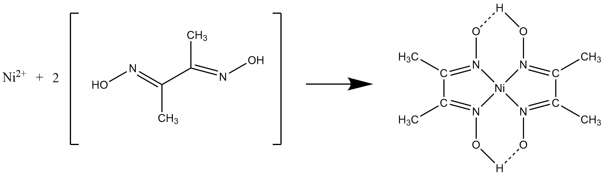

#
# 1. 実験目的
  陽イオンを含む溶液について系統分析を行い, 次にヒーター線の成分分析を行う. これにより元素分析の基礎的な手法を確認する.
  またこの実験により, 金属イオンの性質や陰イオンとの反応性, 難溶性塩に対する理解を深める. 

# 2. 理論
  金属元素のイオン化傾向の差を利用し, イオン化傾向が低い順に沈殿を発生されることで金属イオンを単離する.  
  以下が今回の実験で利用した反応である.
  
  * Fe3+ + 3OH- → Fe(OH)3↓
  * Cr3+ + 3OH- → Cr(OH)3↓
  * Ni2+ + 2C4H8O2N2 → Ni(C4H7O2N2)2↓+2H+
    
  * Cr3+の沈殿を含む溶液を加熱 → 沈殿が溶解
  * CrO42- + Pb(CH3COO)2 + 2H+ → PbCrO4↓ + 2(CH3COO)-
  * 4Fe3+ + 3[Fe(CN)6]4- → Fe4[Fe(CN)6]3↓
  * Fe3+ + SCN- → [FeSCN]2+

# 3. 実験方法
## 3.1 使用器具
  * 試験管 10本
  * ろ過管 2本
  * 蒸発管 2本
  * ガラス棒
  * 駒込ピペット
  * 試験管ばさみ 2個
  * 加圧バルブ
  * 試験管立て
  * ビーカー 2個
  * ろ過綿
  * 湯バス

## 3.2 使用試薬
  * 陽イオン分析溶液(Fe3+, Ni2+, Cr3+を含む)
  * 塩酸 HCl(6 mol/L) と 硝酸 HNO3(6 mol/L) の混合溶液
  * 硝酸 HNO3(6 mol/L)
  * 水酸化ナトリウム NaOH(6 mol/L)
  * 酢酸 CH3COOH(6 mol/L)
  * アンモニア NH3 (15 mol/L)
  * 過酸化水素水 H2O2 (3 %)
  * 塩化アンモニウム水溶液 NH4Claq (飽和)
  * ヘキサシアノ鉄(II)酸カリウム K4[Fe(CN)6] (0.1 mol/L)
  * チオシアン酸カリウム KSCN (0.1 mol/L)
  * 酢酸鉛(II) Pb(OCOCH3) (0.1 mol/L)
  * ジメチルグリオキシムアルコール CH3C(N=OH)C(N=OH)CH3 (1 %)
  * フェノールフタレインアルコール (1 %)
  * 各種ヒーター線

## 3.3 実験手順
### 3.3.1 陽イオン分析溶液
  1. 試験管に陽イオン分析溶液約1 mLを用意した.
  1. 溶液に塩化アンモニウム溶液を1滴滴下し, 続いて沈殿ができるまでアンモニア水溶液を滴下した.
  1. 試験管の溶液を5分間, 沸騰した湯バスの中で加熱した後, 溶液が透明になるまでろ過した. -> 沈殿(1), ろ液(1)
  1. ろ液(1)にジメチルグリオキシムアルコール溶液を1滴滴下した. 溶液には暗褐色の沈殿が生じた.
  1. 2 mLの水に塩化アンモニウム水溶液と1滴のアンモニア水溶液を加え, この溶液で前々項のろ過管に残っている沈殿(1)を洗った. 洗液は捨てた.
  1. 蒸発管に1 mLの水を入れ, 前項のろ管を浸けた. そのろ菅に水酸化ナトリウム溶液3滴と過酸化水素水2滴を滴下し, 湯バスに入れ温めた. ろ菅の綿の上部が黄色くなったら, ろ液を吸い上げ, ろ菅に加えた. ろ菅上部の溶液が蒸発管に流下してから,  この操作をもう1度繰り返した.
  1. 綿中に残っている溶液を加圧ろ過で押し出したのち, ろ過管に1 mLの水を加え, 加圧ろ過した. -> 沈殿(2), ろ液(2)
  1. 前項のろ液(2)にフェノールフタレイン溶液1滴を加え, 赤色が消えるまで酢酸を1滴ずつ加えた. その後酢酸鉛(II)を1滴滴下し, 黄色の沈殿が生じれば, Cr3+が存在している(詳細あは後述).
  1. 前々項のろ菅に残った沈殿を2 mLの水で洗い, 洗液は捨てる. 1 mLの水を蒸発管に入れ, この中にろ過管を浸ける. ろ過管に硝酸溶液2滴を滴下し, 湯バスで蒸発管の水を煮沸する. 綿上の沈殿物が溶けたら1 mLの水を加え, 加圧ろ過する. ろ液を冷却した後, 2つに分け, それぞれ以下の操作を行った.
      1. ろ液にヘキサシアノ鉄(II)酸カリウム水溶液を1滴滴下しした. 溶液には藍色の沈殿が生じた.
      1. ろ液にチオシアン酸カリウム水溶液を1滴滴下した. 溶液には深赤色の沈殿が生じた.

### 3.3.2 ヒーター線(2)
  1. 1mmに切断したヒーター線(2)と塩酸と硝酸の混合溶液約1 mLを試験管に入れ, 湯バスの中で加熱, 溶解させた.
  1. 溶液に塩化アンモニウム溶液を1滴滴下し, 続いて沈殿ができるまでアンモニア水溶液を滴下した.
  1. 試験管の溶液を5分間, 沸騰した湯バスの中で加熱した後, 溶液が透明になるまでろ過した. -> 沈殿(1), ろ液(1)
  1. ろ液(1)にジメチルグリオキシムアルコール溶液を1滴滴下した. 溶液には少量の赤桃色の沈殿が生じた.
  1. 2 mLの水に塩化アンモニウム水溶液と1滴のアンモニア水溶液を加え, この溶液で前々項のろ過管に残っている沈殿(1)を洗った. 洗液は捨てた.
  1. 蒸発管に1 mLの水を入れ, 前項のろ管を浸けた. そのろ菅に水酸化ナトリウム溶液3滴と過酸化水素水2滴を滴下し, 湯バスに入れ温めた. ろ菅の綿の上部が黄色くなったら, ろ液を吸い上げ, ろ菅に加えた. ろ菅上部の溶液が蒸発管に流下してから,  この操作をもう1度繰り返した.
  1. 綿中に残っている溶液を加圧ろ過で押し出したのち, ろ過管に1 mLの水を加え, 加圧ろ過した. -> 沈殿(2), ろ液(2)
  1. 前項のろ液(2)にフェノールフタレイン溶液1滴を加え, 赤色が消えるまで酢酸を1滴ずつ加えた. その後酢酸鉛(II)を1滴滴下した. 溶液には特に沈殿は発生せず, 無色透明であった.
  1. 前々項のろ菅に残った沈殿を2 mLの水で洗い, 洗液は捨てる. 1 mLの水を蒸発管に入れ, この中にろ過管を浸ける. ろ過管に硝酸溶液2滴を滴下し, 湯バスで蒸発管の水を煮沸する. 綿上の沈殿物が溶けたら1 mLの水を加え, 加圧ろ過する. ろ液を冷却した後, 2つに分け, それぞれ以下の操作を行った.
      1. ろ液にヘキサシアノ鉄(II)酸カリウム水溶液を1滴滴下した. 溶液には深青色の沈殿が生じた.
      1. ろ液にチオシアン酸カリウム水溶液を1滴滴下した. 溶液には深赤色の沈殿が生じた.

### 3.3.3 ヒーター線(4)
  1. 1mmに切断したヒーター線(4)と塩酸と硝酸の混合溶液約1 mLを試験管に入れ, 湯バスの中で加熱, 溶解させた.
  1. 各溶液に塩化アンモニウム溶液を1滴滴下し, 続いて沈殿ができるまでアンモニア水溶液を滴下した.
  1. 試験管の各溶液を5分間, 沸騰した湯バスの中で加熱した後, 溶液が透明になるまでろ過した. -> 沈殿(1), ろ液(1)
  1. ろ液(1)にジメチルグリオキシムアルコール溶液を1滴滴下した. 溶液には赤桃色の沈殿が生じた.
  1. 2 mLの水に塩化アンモニウム水溶液と1滴のアンモニア水溶液を加え, この溶液で前々項のろ過管に残っている沈殿(1)を洗った. 洗液は捨てた.
  1. 蒸発管に1 mLの水を入れ, 前項のろ管を浸けた. そのろ菅に水酸化ナトリウム溶液3滴と過酸化水素水2滴を滴下し, 湯バスに入れ温めた. ろ菅の綿の上部が黄色くなったら, ろ液を吸い上げ, ろ菅に加えた. ろ菅上部の溶液が蒸発管に流下してから,  この操作をもう1度繰り返した.
  1. 綿中に残っている溶液を加圧ろ過で押し出したのち, ろ過管に1 mLの水を加え, 加圧ろ過した. -> 沈殿(2), ろ液(2)
  1. 前項のろ液(2)にフェノールフタレイン溶液1滴を加え, 赤色が消えるまで酢酸を1滴ずつ加えた. その後酢酸鉛(II)を1滴滴下した.　溶液には黄色の沈殿が生じた.
  1. 前々項のろ菅に残った沈殿を2 mLの水で洗い, 洗液は捨てる. 1 mLの水を蒸発管に入れ, この中にろ過管を浸ける. ろ過管に硝酸溶液2滴を滴下し, 湯バスで蒸発管の水を煮沸する. 綿上の沈殿物が溶けたら1 mLの水を加え, 加圧ろ過する. ろ液を冷却した後, 2つに分け, それぞれ以下の操作を行った.
      1. ろ液にヘキサシアノ鉄(II)酸カリウム水溶液を1滴滴下した. 溶液には深青色の沈殿が生じた.
      1. ろ液にチオシアン酸カリウム水溶液を1滴滴下した. 溶液には深赤色の沈殿が生じた.

# 4. 実験結果
  今回の実験では, 2番と4番のサンプルを使用した.
  実験で発生した変化は以下の通りである.
  
表1. 各溶液にできた沈殿物

  |滴下した溶液|陽イオン分析溶液|サンプル2|サンプル4|
  |:-:|:-:|:-:|:-:|
  |塩化アンモニウム+アンモニア溶液|暗褐色の沈殿|赤褐色の沈殿|暗褐色の沈殿|
  |ジメチルグリオキシムアルコール|暗褐色の沈殿|ごく少量の赤桃色の沈殿|赤桃色の沈殿|
  |酢酸鉛(II)|黄色の沈殿|無色透明|黄色の沈殿|
  |ヘキサシアノ鉄(II)酸カリウム|深青色の沈殿|深青色の沈殿|深青色の沈殿|
  |チオシアン酸カリウム|深赤色の沈殿|深赤色の沈殿|深赤色の沈殿|

# 5. 考察
  * 手順1-1でアンモニアを滴下した際, 白煙が生じた. これは, アンモニアと塩酸が反応し, 固体の塩化アンモニウムとなったものだと推察できる.
  * 陽イオン分析溶液にジメチルグリオキシムアルコールを滴下したら暗褐色の沈殿が発生したが, ニッケルよりもイオン化傾向が低い金属が含まれていたためと考えられる.
  * サンプル2, サンプル4を含む溶液にジメチルグリオキシムアルコールを滴下したら, 赤桃色の沈殿が確認できた. この事から, サンプル2とサンプル4にはニッケルが含まれている事が確認できた.
  * サンプル2を含む溶液に酢酸鉛(II)溶液を滴下したら, 無色透明であった. この事から, サンプル2にクロムが含まれていないことがわかる.
  * 各溶液に対しヘキサシアノ鉄(II)酸カリウム溶液を滴下したら, それぞれ深青色の沈殿が生じた. この事から, 陽イオン分析溶液, サンプル2, サンプル4の全てに鉄が含まれていることが確認できた.
  * 各溶液に対しチオシアン酸カリウム溶液を滴下したら, それぞれ深赤色の沈殿が生じた. この事から, 陽イオン分析溶液, サンプル2, サンプル4の全てに鉄が含まれていることが確認できた.

  * 調べた結果, 一般的に電熱線として使用される物は以下のようであった.
      * 鉄クロム線
      * ニッケルクロム線
      * 銅マンガン線
      * 銅ニッケル線
      * ニッケルアルミニウム線
  
  * 以上のことから, サンプル2が上記にはない種類のものであると推測できる.
  * 以上のことから, サンプル4が鉄を含むニクロム線であると推測できる.

# 6. 感想, 意見
  * 15 mol/Lもの濃度のアンモニアを扱うのは初めてで, 手で仰いでもいないのに刺激臭がし, 鼻が曲がるかと思った.
  * 局所排気が上手く固定できなかったのが少し不便であった.

# 7. 参考文献
  * 東京書籍 化学 p.260~263
  * ニッケル線・クロム線・マンガン線・その他線 | マテリアルエコリファイン株式会社 <http://group.mmc.co.jp/merc/ja/metalworking/alloy-wire.html>
